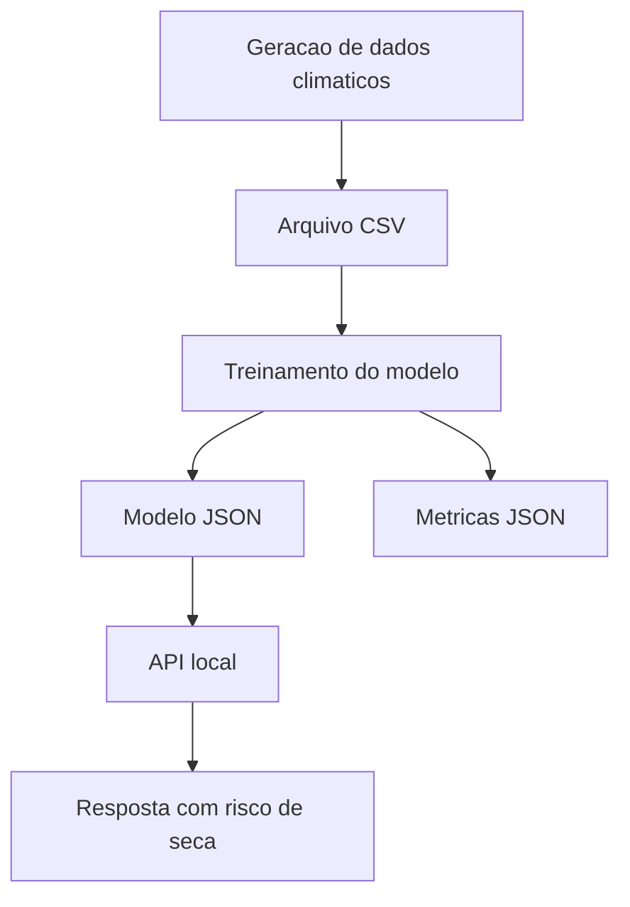

# Modelo Base do PDF - Global Solution 2026.1

## Capa

**Titulo do projeto:** Space Climate AI - Monitoramento Climatico Inteligente com IA

**Integrantes:**

- Preencher nome completo do integrante 1
- Preencher nome completo do integrante 2
- Preencher nome completo do integrante 3

**Observacao:**

Nao incluir a frase "QUERO CONCORRER", pois a entrega atual nao sera para disputa de podio.

---

## 1. Introducao

A nova economia espacial ampliou o uso de satelites e sensores orbitais para monitoramento ambiental, agricultura, rastreamento global, previsao climatica e prevencao de desastres. Esses dados criam oportunidades para o uso de Inteligencia Artificial na identificacao de padroes e na construcao de sistemas de apoio a decisao.

Dentro desse contexto, este projeto apresenta uma Prova de Conceito chamada Space Climate AI. A proposta consiste em simular dados climaticos inspirados em sensoriamento remoto e aplicar um modelo de Machine Learning para prever risco de seca em diferentes regioes. O objetivo e demonstrar como tecnologias digitais podem transformar dados de origem espacial em informacoes uteis para impacto positivo na Terra.

---

## 2. Desenvolvimento

### 2.1 Problema abordado

Secas e eventos climaticos extremos causam impactos economicos, sociais e ambientais. Antecipar sinais de risco ajuda no planejamento agricola, no uso racional da agua e na resposta a eventos adversos.

### 2.2 Proposta de solucao

A solucao desenvolvida simula o uso de dados orbitais para monitorar indicadores ambientais e prever risco de seca. O sistema foi dividido em quatro partes principais:

1. Geracao de dados climaticos sinteticos.
2. Treinamento de um modelo de classificacao.
3. Salvamento do modelo e das metricas.
4. Disponibilizacao da previsao por meio de uma API local.

### 2.3 Arquitetura da solucao

### 2.4 Dados utilizados

O dataset sintetico contem registros diarios de 24 regioes ao longo de 365 dias. Cada observacao possui as seguintes variaveis:

- temperatura da superficie
- NDVI
- chuva acumulada em 7 dias
- umidade do solo
- cobertura de nuvens
- evapotranspiracao
- classe alvo de risco de seca

Esses atributos foram definidos para aproximar o tipo de informacao que pode ser derivada ou relacionada a imagens e sensores de observacao da Terra.

### 2.5 Inteligencia Artificial aplicada

Foi utilizado um modelo de regressao logistica implementado do zero em Python. O modelo recebeu como entrada os indicadores climaticos e aprendeu a classificar se uma observacao representa baixo ou alto risco de seca.

Mesmo sendo uma implementacao enxuta, ela demonstra os fundamentos de Machine Learning vistos no curso:

- preparacao de dados
- separacao treino e teste
- padronizacao de atributos
- treinamento supervisionado
- inferencia
- avaliacao por metricas

### 2.6 API e integracao

Depois do treinamento, o modelo passa a ser consumido por uma API local com dois endpoints:

- `GET /health` para verificar disponibilidade
- `POST /predict` para realizar previsoes

Esse ponto reforca a integracao entre IA e aplicacoes digitais, permitindo demonstrar a solucao de forma pratica.

### 2.7 Principais trechos de codigo

Inserir no PDF, como texto, trechos dos arquivos abaixo:

- `run_pipeline.py`
- `src/space_climate_ai/data.py`
- `src/space_climate_ai/train.py`
- `src/space_climate_ai/api.py`

Sugestao: incluir apenas os trechos principais, com breve explicacao logo abaixo de cada um.

---

## 3. Resultados Esperados

O sistema foi executado com sucesso, gerando dataset, modelo treinado e API funcional. As metricas obtidas foram:

- Accuracy: 0.9648
- F1-score: 0.9806
- ROC AUC: 0.99

Esses resultados indicam que o modelo conseguiu identificar com alta consistencia o padrao sintetico de risco de seca. Embora os dados sejam simulados, a POC demonstra de forma clara a aplicacao de IA em um problema inspirado pela economia espacial.

Tambem foi validado um exemplo de requisicao na API, retornando probabilidade de risco, rotulo numerico e classificacao textual.

Inserir nesta secao:

- print do terminal executando `python run_pipeline.py`
- print do terminal executando `python run_api.py`
- print da chamada da API ou resposta JSON
- print da estrutura de pastas do projeto

---

## 4. Conclusoes

O projeto Space Climate AI demonstra que e possivel transformar dados inspirados em observacao orbital em uma solucao pratica de apoio a decisao. A POC integra geracao de dados, treinamento de modelo, avaliacao de desempenho e disponibilizacao por API, cobrindo competencias importantes do curso.

Mesmo com escopo controlado, a proposta atende aos requisitos minimos da Global Solution ao combinar Inteligencia Artificial, analise de dados e uma aplicacao funcional. Como evolucoes futuras, o projeto poderia incorporar dados reais de satelite, dashboard visual, banco de dados, integracao em nuvem e monitoramento em tempo real.

---

## 5. Links obrigatorios no final do PDF

- Link do repositorio GitHub
- Link do video no YouTube em modo nao listado

---

## 6. Checklist antes de exportar o PDF

- Inserir os nomes completos dos integrantes na primeira pagina
- Revisar ortografia e padronizacao visual
- Garantir que todos os codigos no documento estejam em texto, nunca em print
- Inserir imagens da execucao e da arquitetura
- Colocar os links finais do repositorio e do video
- Exportar tudo em um unico PDF